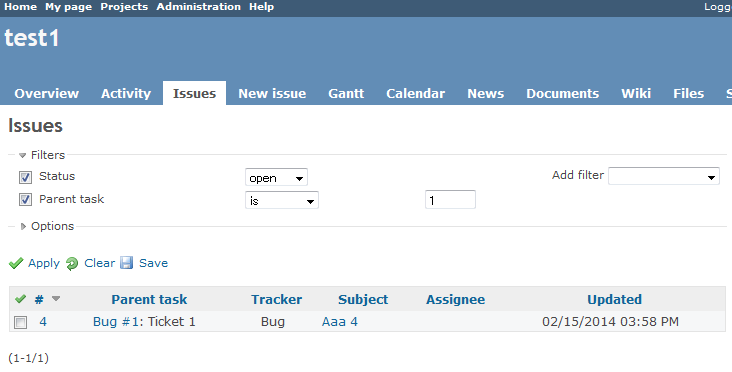
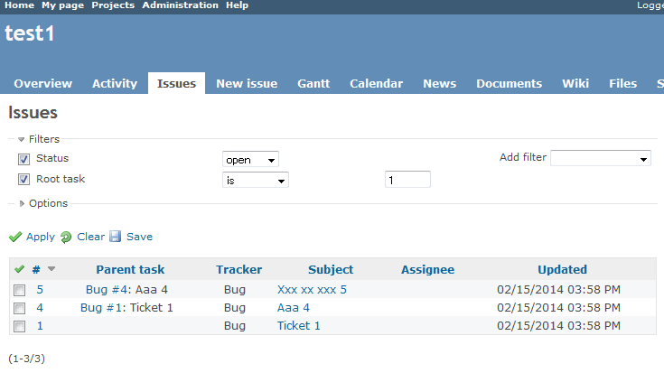

Redmine parent issue filter
===========================

This a plugin added parent issue filter and root issue filter for the [Redmine](http://www.redmine.org).

Features
--------

Added 2 filters on issues page.

### Parent task(issue) filter

### Root task(issue) filter

Supported versions
------------------

* Redmine 2.0.x or later

License
-------

The plugin is available under the terms of the [GNU General Public License](http://www.gnu.org/licenses/gpl-2.0.html), version 2 or later.

